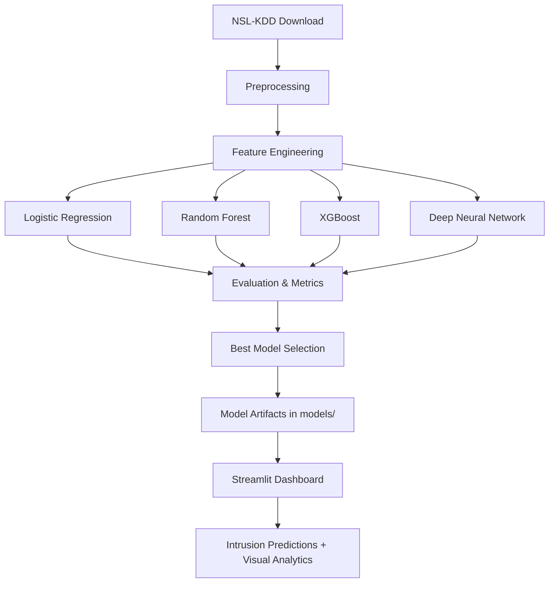

# AI-Powered Network Intrusion Detection System

A production-ready machine learning and deep learning system for detecting malicious network traffic using the NSL-KDD dataset.

## Project Overview

This project builds an end-to-end intrusion detection workflow that:
- Automatically downloads and preprocesses NSL-KDD data.
- Trains and evaluates multiple models (ML + DL).
- Selects and saves the best-performing model.
- Provides an interactive Streamlit dashboard for batch prediction and attack analytics.

## Repository Structure

```text
Network-Intrusion-Detection-System/
│
├── data/
├── notebooks/
├── src/
│   ├── preprocessing.py
│   ├── feature_engineering.py
│   ├── train_model.py
│   ├── evaluate_model.py
│   ├── predict.py
│
├── models/
├── dashboard/
│   └── app.py
│
├── scripts/
│   └── setup.sh
│
├── requirements.txt
├── README.md
├── .gitignore
└── main.py
```

## System Architecture



## Dataset Explanation (NSL-KDD)

The NSL-KDD dataset is an improved version of KDD'99, designed for network intrusion detection benchmarking.

- **Input features**: 41 network traffic features (categorical + numerical).
- **Target**: Attack category label.
- **Binary conversion**: `normal` -> 0, all attack labels -> 1.
- **Automatic download**: If `data/KDDTrain+.txt` or `data/KDDTest+.txt` are missing, files are downloaded automatically.

## Models Implemented

- Logistic Regression
- Random Forest
- XGBoost
- Deep Neural Network (TensorFlow / Keras)

## Evaluation Metrics

For each model, the system computes:
- Accuracy
- Precision
- Recall
- F1 Score
- Confusion Matrix (saved as PNG)

Comparison artifacts are saved in `models/`:
- `metrics_summary.csv`
- `model_comparison_f1.png`
- `<model>_confusion_matrix.png`
- `best_model_metadata.json`

## Installation

### 1) Clone repository

```bash
git clone <repo>
cd Network-Intrusion-Detection-System
```

### 2) Automatic environment setup

```bash
bash scripts/setup.sh
source venv/bin/activate
```

The setup script runs:
- `python -m venv venv`
- `source venv/bin/activate`
- `pip install -r requirements.txt`

## Usage

### Train models

```bash
python main.py
```

### Launch dashboard

```bash
streamlit run dashboard/app.py
```

### Predict from your own CSV (Python API)

```python
from src.predict import predict_from_csv
predict_from_csv("input.csv", "predictions.csv", models_dir="models")
```

## Results and Model Comparison

After training, inspect:
- `models/metrics_summary.csv` for numeric performance comparison.
- `models/model_comparison_f1.png` for visual F1 comparison.
- Per-model confusion matrix PNG files for error distribution.

The system automatically selects the model with the highest F1 score as the best model for deployment.

## Dashboard Features

The Streamlit dashboard supports:
- Upload network traffic CSV data.
- Run intrusion detection using the best trained model.
- View row-level predictions and attack probabilities.
- Download predictions as CSV.
- Visualize attack statistics with bar and pie charts.

## Screenshots

Add dashboard and result screenshots in this section for GitHub presentation.

Example placeholders:
- `docs/screenshots/dashboard-home.png`
- `docs/screenshots/prediction-results.png`
- `docs/screenshots/attack-statistics.png`

## Future Improvements

- Add multiclass attack type classification.
- Integrate real-time packet capture (e.g., with Zeek/Scapy).
- Add SHAP explainability views in dashboard.
- Package model serving with FastAPI.
- Add CI/CD, tests, and containerized deployment.

## Quick Start Commands

```bash
git clone <repo>
cd Network-Intrusion-Detection-System
bash scripts/setup.sh
python main.py
streamlit run dashboard/app.py
```
