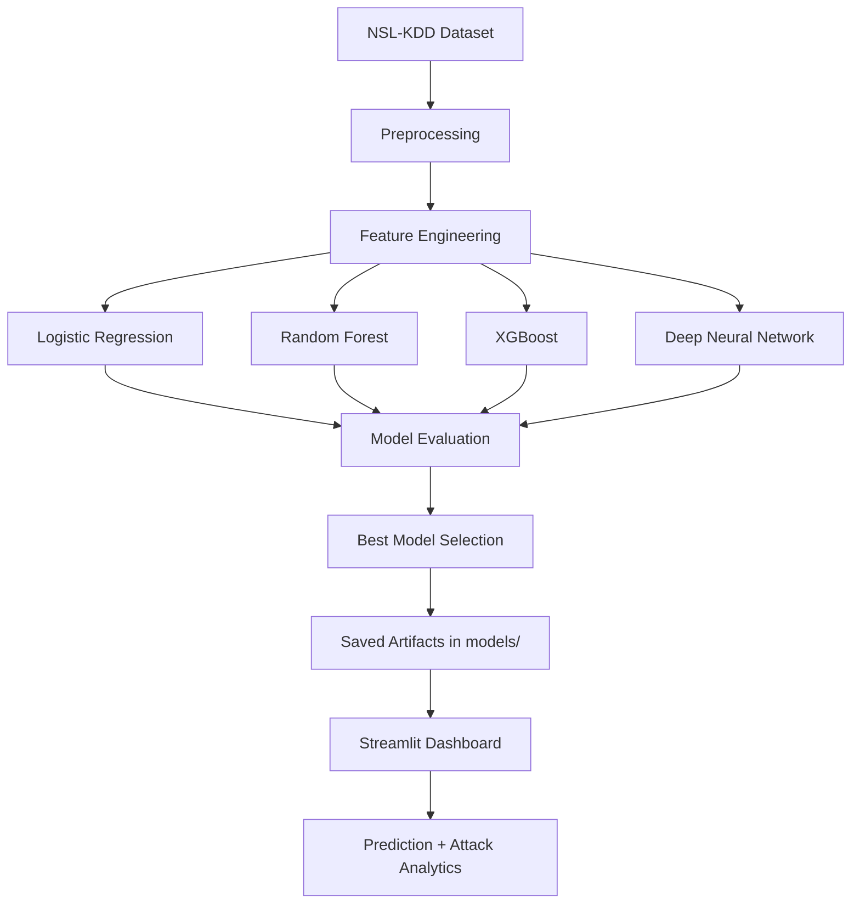

# AI-Powered Network Intrusion Detection System

A production-ready machine learning and deep learning system for detecting malicious network traffic using the NSL-KDD dataset.

## Project Overview

This project builds an end-to-end intrusion detection workflow that:
- Loads and preprocesses NSL-KDD network traffic data.
- Trains multiple machine learning and deep learning models.
- Evaluates each model using accuracy, precision, recall, and F1 score.
- Saves the best-performing model and its metrics artifacts.
- Provides a Streamlit dashboard for batch intrusion prediction and analytics.

## Repository Structure

```text
Network-Intrusion-Detection-System/
├── data/
│   ├── KDDTrain+.txt
│   └── KDDTest+.txt
├── dashboard/
│   └── app.py
├── models/
│   ├── best_model.joblib
│   ├── best_model_metadata.json
│   ├── deep_neural_network.keras
│   ├── logistic_regression.joblib
│   ├── metrics_summary.csv
│   ├── preprocessor.joblib
│   ├── random_forest.joblib
│   └── xgboost.joblib
├── notebooks/
├── scripts/
│   └── setup.sh
├── src/
│   ├── evaluate_model.py
│   ├── feature_engineering.py
│   ├── predict.py
│   ├── preprocessing.py
│   └── train_model.py
├── .gitignore
├── main.py
├── README.md
├── requirements.txt
└── .venv/
```

## System Architecture



## Dataset Explanation (NSL-KDD)

The NSL-KDD dataset is an improved version of KDD'99, designed for intrusion detection benchmarking.

- Input features: 41 network traffic attributes
- Target: binary intrusion label
- Normal traffic: mapped to 0
- Attack traffic: mapped to 1
- Training and testing data are loaded from the data folder for model development and evaluation

## Models Implemented

- Logistic Regression
- Random Forest
- XGBoost
- Deep Neural Network (TensorFlow / Keras)

## Evaluation Metrics

For each model, the system computes:
- Accuracy
- Precision
- Recall
- F1 Score
- Confusion Matrix plots saved as PNG files

Comparison artifacts in models/ include:
- metrics_summary.csv
- model_comparison_f1.png
- best_model_metadata.json
- per-model confusion matrix images

## Installation

### 1) Clone repository

```bash
git clone <repository-url>
cd Network-Intrusion-Detection-System
```

### 2) Automatic environment setup

```bash
bash scripts/setup.sh
source venv/bin/activate
```

The setup script creates a virtual environment and installs the dependencies in requirements.txt.

## Usage

### Train models

```bash
python main.py
```

### Launch dashboard

```bash
streamlit run dashboard/app.py
```

### Predict from your own CSV (Python API)

```python
from src.predict import predict_from_csv

predict_from_csv(
    "input.csv",
    "predictions.csv",
    models_dir="models",
)
```

## Results and Model Comparison

After training, inspect:
- models/metrics_summary.csv for numeric performance comparison
- models/model_comparison_f1.png for visual F1 comparison
- per-model confusion matrix PNG files for error analysis

The system automatically selects the model with the highest F1 score as the best model for deployment.

## Dashboard Features

The Streamlit dashboard supports:
- Upload network traffic data as a CSV file
- Run intrusion detection using the best trained model
- View row-level predictions and attack probabilities
- Download predictions as a CSV file
- Visualize attack statistics with bar and pie charts

## Future Improvements

- Add multiclass attack type classification
- Integrate real-time packet capture and monitoring
- Add SHAP explainability views in the dashboard
- Package model serving with FastAPI
- Add tests and CI/CD automation

## Quick Start Commands

```bash
git clone <repository-url>
cd Network-Intrusion-Detection-System
bash scripts/setup.sh
python main.py
streamlit run dashboard/app.py
```

